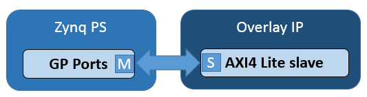
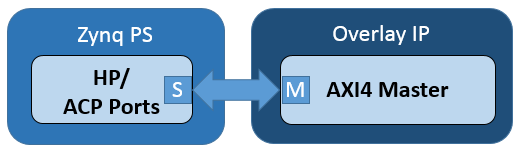
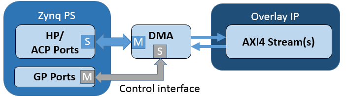
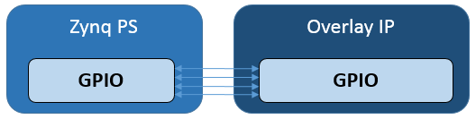

*******************************
PS/PL Data Transfer
*******************************

.. contents:: Table of Contents
   :depth: 2
   
Introduction
==================

There are four PYNQ classes that are used for data transfer between PS and PL. 

* MMIO - Memory Mapped IO
* Xlnk - Memory allocation
* DMA  - Direct Memory Access
* GPIO - General Purpose Input/Output

The class used depends on the Zynq PS interface the IP is connnected to, and the interface of the IP. 

Zynq interfaces
---------------------

AXI interfaces are the main connections for transferring data between the PS and the PL. The Zynq has 2 AXI GP (General Purpose) masters (master from PS to PL) and 2 AXI GP slaves (slave from PS to PL), 4 AXI HP (High Performance) slaves, and one ACP AXI slave. An AXI master can be connected to either a HP port or the ACP port. 

IP Interfaces
---------------------

There are four main interface types for IP blocks.

* AXI4 Slave
* AXI4 Master
* AXI4 Stream
* GPIO

AXI4 Slave
^^^^^^^^^^^

An AXI4 slave can be connected to an AXI GP Master port. 
 

The AXI GP port on Zynq is usually used for lower performance IP, or for control interfaces. 

AXI4 Master
^^^^^^^^^^^^^^^^^

An AXI4 Master can be connected to the AXI GP Slave ports, HP ports, or ACP. 

HP ports are usually used for high performance peripherals that need access to DRAM. For example, a video controller can write video data to DRAM through a HP port without any interaction from the main CPU. 

AXI4 Stream
^^^^^^^^^^^^^^^

AXI4 streams are data channels and have no address signals. This means they need an IP block to convert memory mapped transactions in the PS to stream transactions and vice versa. A DMA is one way to do this. A DMA can have an AXI lite control interface connected to an AXI GP Master port, and AXI4 Master port connected to a HP port to access DDR, and an AXI4 stream port to connect to the AXI stream. The AXI lite control port can be used to initiate a transaction, data can be read from the DRAM and sent to the AXI4 stream, or received from the AXI stream and sent to DRAM. 

GPIO
^^^^^^^^^^^^^^

There are also GPIO, which are simple wires between PS and PL.  

GPIO wires from the PS can be used as a very simple way to communicate between PS and PL. For example, GPIO can be used as control signals for resets, or interrupts. 

PYNQ classes 
-------------

MMIO
^^^^^^^^^^

MMIO can be used read/write a memory mapped location. A MMIO read or write command can transfer 32 bits of data. MMIO is most appropriate for reading and writing small amounts of data.

The following example sets up an MMIO instance to access memory location IP_BASE_ADDRESS - IP_BASE_ADDRESS + ADDRESS RANGE (0x40000000 - 0x40001000).

Some *data* (e.g. 0xdeadbeef) is sent to location ADDRESS_OFFSET (0x10). ADDRESS_OFFSET is offset from the IP base address IP_BASE_ADDRESS. This means 0xdeadbeef will be written to 0x40000010. 

The same location is then read and stored in *result*. 

.. code-block:: Python

   IP_BASE_ADDRESS 0x40000000
   ADDRESS_RANGE = 0x1000
   ADDRESS_OFFSET = 0x10
   
   from pynq import MMIO   
   mmio = MMIO(IP_BASE_ADDRESS, ADDRESS_RANGE) 

   data = 0xdeadbeef
   self.mmio.write(ADDRESS_OFFSET, data)
   result = self.mmio.read(ADDRESS_OFFSET)

This example assumes the memory mapped area defined for the MMIO, 0x40000000 - 0x40001000, is accessible to the PS. 

Xlnk
^^^^^^^^^^^^^

PYNQ runs on Linux, which uses virtual memory. The Zynq AXI Slave ports allow a master in an overlay to access physical memory. Memory must be allocated, before it can be accessed by the IP.
``Xlnk`` allows memory buffers to be allocated. Xlnk provides a virtual pointer to the memory buffer. This allows Python or other code running in Linux on the PS to access the memory buffer. Xlnk also provides the physical memory pointer which can be sent to an IP in the overlay. The IP can then access the same buffer from using the physical address. 

For example, a program running on a MicroBlaze processor in an overlay may need to write data to main memory so that it could be read in Python. First, the memory can be allocated in Linux using Xlnk. Then the physical pointer is sent to the MicroBlaze, and finally the MicroBlaze program and write data to the memory buffer using the pointer. 

Xlnk is also used implicitly by the DMA class. 

In the following example, an Xlnk instance, *mmu*, is created. *cma_alloc()* is used to allocate a block of memory of size MEMORY_SIZE (0x1000 in this example). A virtual pointer is returned to *bufPtr*. The buffer can be accessed in Python as seen in the for loop. Calling *cma_get_phy_addr()* on the virtual pointer gets the physical address which allows access to the buffer from an IP in the overlay. 

Xlnk example
^^^^^^^^^^^^^^^

.. code-block:: Python

   MEMORY_SIZE = 0x1000
   
   from pynq import Xlnk
   mmu = Xlnk()   
   
   bufTtr = mmu.cma_alloc(MEMORY_SIZE)
   phyAddr = mmu.cma_get_phy_addr(buf_ptr)
   
   
   for i in range(MEMORY_SIZE):
      bufPtr[i] = i
   

Data can be written to the buffer, and the physical address can be sent to a block in the accelerator (for example and IOP) which could then access the buffer from DDR memory. 

DMA
^^^^^^^^^

The PYNQ DMA class supports the `AXI Direct Memory Access IP <https://www.xilinx.com/support/documentation/ip_documentation/axi_dma/v7_1/pg021_axi_dma.pdf>`_. 
This allows data to be read from DRAM, and sent to an AXI stream, or received from a stream and written to DRAM. 

DMA example
^^^^^^^^^^^^^^

This example assumes the overlay contains two AXI Direct Memory Access IP, one with a read channel from DRAM, and an AXI Master stream interface (for an output stream), and the other with a write channel to DRAM, and an AXI Slave stream interface (for an input stream). 

Two DMA instances are created using the physical address of the DMA in the overlay. The addresses can be found in the *overlay* ``.ip_dict``. The direction of the DMA is also specified (0: DMA to device - output stream, 1: DMA from device - input stream). 

A memory buffer is then allocated using *create_buf()*, and the buffer pointer is obtained with *get_buf()*. The buffer data type width can be specified as 32 bit or 64 bit. The memory buffer can then be accessed from Python. For example, some data to be transferred to the IP can be written to the buffer. 
The DMA can then start the transfer by calling the *transfer()* function, specifying the number of bytes to transfer, and the direction (0 : DMA to device). Data can be captured from the recv buffer in a similar way. 

.. code-block:: Python

    dma_send = DMA(dma_send_addr, 0)  # 'DMA_TO_DEV'
    dma_recv = DMA(dma_recv_addr, 1) # 'DMA_FROM_DEV'
    
    
    dma_send.create_buf(1024)
    send_buffer = dma_send.get_buf(32)
    
    transfer_size = 1024
    
    # Send DMA - from DRAM to stream
    for i in range(transfer_size):
        send_buffer[i] = i
        
    dma_send.transfer(transfer_size*4, 0)
    
    # Receive DMA - from stream to DRAM
    dma_recv.create_buf(1024)
    recv_buffer = dma_recv.get_buf(32)
    
    dma_write.transfer(transfer_size*4, 1)
    for i in range(transfer_size):
        print(recv_buffer[i])
    