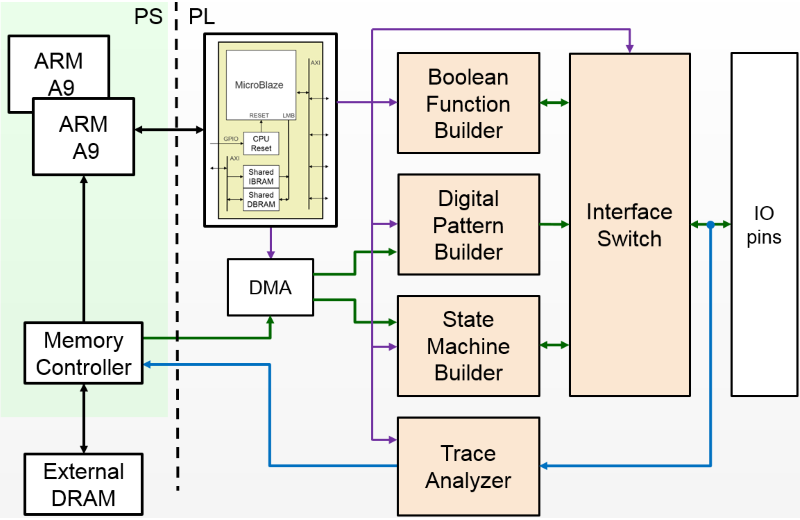

 
Digital Interfacing Overlay overview
======================================

Introduction
--------------------

The Digital Interfacing Overlay (DIO) consists programmable hardware blocks for interfacing to external digital logic circuits. A programmable switch connects the inputs and outputs from the hardware blocks to Zynq IO pins. The DIO can also capture data from the IO interface for analysis and debug. 

DIO functions
-------------------

The DIO includes the following hardware blocks:

* Digital Pattern Builder
* State Machine Builder
* Boolean Function Builder
* Trace Analyzer

The *Digital Pattern Builder* (DPB) can be programmed to generate arbitrary  patterns and stream the pattern to IO pins. 

The *State Machine Builder* (SMB) can create a finite state machine from a Python description. The inputs and outputs of the FSM can be connected to external IO pins.

The *Boolean Function Builder* (BFB) can be create combinatorial boolean functions. The external IO pins are used as inputs and outputs. 

The *Trace Analyzer* (TA) can capture and stream IO signals to the PS DRAM for analysis in the Python environment. The Trace Analyzer can be used standalone to capture external IO signals, or used in combination with the other three DIO functions to monitor data to and from the other blocks.  E.g. the tracebuffer can be used with the pattern generator to verify the data sent to the output pins. or on the FSM to check the input signals. 

DIO Block Diagram
^^^^^^^^^^^^^^^^^^^^^^

   
The builders are connected to an interface switch. The interface switch is connected to Zynq IO pins and can be programmed to route any of the available IO to the builders. 

The DPB and SMB are connected to a DMA which is used to stream configuration data to the builders. 

The TA taps into all the IO signals, and has a connection through the DMA back to the PS DRAM. 

The DIO contains a MicroBlaze which controls the other blocks in the design, including the Interface Switch. 

DIO Project files
^^^^^^^^^^^^^^^^^^^^^^^

All source code for the hardware blocks is provided, and each block can also be reused standalone in a custom overlay. 

The project files for the DIO overlay can be found here:

.. code-block:: console

   ``<GitHub Repository>/boards/<board>/dio``

The makefile and .tcl file can be used to rebuild the overlay. The DIO overlay includes IP from the Vivado library, and PYNQ IP. PYNQ IP can be found in directory:

.. code-block:: console

   ``<GitHub Repository>/boards/ip`` 

Operation
--------------------

There are three builders, the Boolean Function Builder (BFB), State Machine Builder (SMB) and the Digital Pattern Builder (DPB). The Trace Analyzer is consider seperately to the builders. 

   .. code-block:: Python

      builders = {BFB, SMB, DPB}

Each builder has the following methods:

* ``setup()`` - configure the builder and prepare Interface Switch configuration
* ``run()`` - configure Interface Switch, and start the builder running and apply settings to the Interface Switch
* ``stop()`` - stop and disconnect the builder from the IO
* ``reset()`` - clear the builder configuration

The trace for each block can be enabled/disabled and configured with the ``trace()`` method.

Any one of these builders, or any combination of these builders can be configured and run synchronously. 

The DIO interface switch will be connected to external IO pins. Initially, all IO accessible to the DIO are configured as inputs. This prevents the inadvertent driving of any external circuitry that is connected before the DIO has been configured. 

The DPB contains BRAM to store the pattern to be generated. The BRAM will be configured with zeros initially. 

Similarly, the SMB configuration is stored in a BRAM which is also configured with zeros initially. 

The BFB is initially set to <>

Setup 
^^^^^^^^^^^^^^^^^^

Each builder must be configured using the ``setup()`` method before it can be used. This defines a configuration for the block, and the configuration for the Interface Switch to connect the external IO to the builder. Note that the configuration is defined, but the IO are not connected during setup. 

Running
^^^^^^^^^^^^^^^^^^

Once a builder has been setup, it can be run. The external IO are connected to the builder though the interface switch, and the hardware block will start operating. 

Running will start the builder running in continuous mode by default. This is the only mode for the BFB. 

In continuous mode, the DPB generates its pattern continuously, looping back to the start when it reaches the end of the pattern. The SMB will continue to run until it is stopped. 

The digital pattern builder can also be run in single-shot mode. In this mode, it will generate its pattern once. 

Stepping
^^^^^^^^^^^^^^^^^^

Instead of running, the DPB and SMB can also be single stepped. 

When stepping the DPB, it will step until the end of the configured pattern. It will not loop back to the beginning. 

The SMB can be single stepped indefinitely. 

Stopping
^^^^^^^^^^^^^^^^^^

If a builder is running, it must be stopped before running or stepping it again. Once a builder is stopped, its outputs are disconnected from the IO.

  
 
Digital Pattern Builder
-------------------------------

The DPB allows arbitrary patterns to be streamed to IO. This can be used to test external peripherals, or as a way to drive external device. Patterns of up to 8K can be described in a JSON (text format), stored in FPGA BRAM, and streamed out to the interface pins on demand.  

Waveform notation
^^^^^^^^^^^^^^^^^^

Waveforms can be defined with the following notation:

.. code-block:: console

   l: low
   h: high
   .: no change

The pattern can be repeated a number of times by "multiplying". E.g. the following will toggle the signal low-high 64 times.  

.. code-block:: console

   *'lh' /* 64* 

The length of patterns will be automatically padded to match the length of the longest specified pattern. 

Example 
^^^^^^^^^^^^^^^^^^

.. code-block:: Python

   loopback_test = {'signal': [
        ['stimulus',
            {'name': 'clk0',  'pin': 'D0', 'wave': 'lh' * 64},
            {'name': 'clk1',  'pin': 'D1', 'wave': 'l.h.' * 32},
            {'name': 'clk2',  'pin': 'D2', 'wave': 'l...h...' * 16},      
        ['analysis',
            {'name': 'clk0',  'pin': 'D0'},
            {'name': 'clk1',  'pin': 'D1'},
            {'name': 'clk2',  'pin': 'D2'}]], 

        'foot': {'tock': 1, 'text': 'Loopback Test'},
        'head': {'tick': 1, 'text': 'Loopback Test'}}

   # show start, stop, continuous, one shot

State Machine Builder
--------------------------------------

The State Machine builder allows finite state machines to be specified from Python in a JSON format. The JSON description can be passed to the ``setup()`` method which will program the overlay to implement the FSM. The FSM states can be graphed and displayed inside a Jupyter Notebook. 

The FSM supports up to 20 pins that can be used in any combination of inputs or outputs. Up to xxx states are supported. 

The specification for the finite state machine is a list of inputs, outputs, states, and transitions. 

Input and outputs are listed as tuples, specifying a pin and label for the pin. 

.. code-block:: Python

    ('reset','D0')
    
Valid pins are found in the interface specification:

Transitions  are specified by defining the input bits, '01' in the following example, the current state, 'S0', the next state, 'S5', and the output bits '011'.
    
.. code-block:: Python

    ['01', 'S0', 'S5', '000']
    

Wildcards for inputs '-' and for states '\*' can be used. 

.. code-block:: Python

    ['-1', '*', 'S5', '000']

Specifying ‘use_state_bits=True’ will output the state to unassigned bits on the interface. If there are no unused pins available, the last few output pins will be automatically overwritten to show state bits instead. 

Example 
^^^^^^^^^^^^^^^^^^^^^
     
.. code-block:: Python

   fsm_spec = {'inputs': [('reset','D0'), ('direction','D1')],
               'outputs': [('bit2','D3'), ('bit1','D4'), ('bit0','D5')],
               'states': ['S0', 'S1', 'S2', 'S3', 'S4', 'S5'],
               'transitions': [['00', 'S0', 'S1', '000'],
                               ['01', 'S0', 'S5', '000'],
                               ['00', 'S1', 'S2', '001'],
                               ['01', 'S1', 'S0', '001'],
                               ['00', 'S2', 'S3', '010'],
                               ['01', 'S2', 'S1', '010'],
                               ['00', 'S3', 'S4', '011'],
                               ['01', 'S3', 'S2', '011'],
                               ['00', 'S4', 'S5', '100'],
                               ['01', 'S4', 'S3', '100'],
                               ['00', 'S5', 'S0', '101'],
                               ['01', 'S5', 'S4', '101'],
                               ['1-', '*',  'S0', '']]}
   
   # show start, stop, continuous, one shot
   
display_graph()

Boolean Function Builder
-------------------------------------------

The BFB supports boolean functions of one up to five inputs on each output pin. AND, OR, NOT, and XOR operators are supported.

Example 
^^^^^^^^^^^^^^^^^^^^^

Combinatorial boolean expressions can be defined in a Python list using the expressions & (AND), | (OR), ! (NOT), ^ (XOR). The expression list also defines the input and output pins. 
 
The following list defines four combinatorial functions on pins D8-11, which are built using combinatorial functions made up of inputs from pins D0-D3. Any pin assigned a value is an output, and any pin used as a parameter in the expression is an input. If a pin is defined as an output, it cannot be used as an input.

.. code-block:: Python

   from dio improt BoolFuncBuilder

   bf_builder = BoolFuncBuilder
   function_specs = ['D3 = D0 ^ D1 ^ D2',
                   'D7 = D3 & D4 & D5']
                   
   function_specs.append('D11 = D12 + D14')

Where D<0-20> are the available IO pins. 

The function configurations can also be labelled:

.. code-block:: Python

   function_specs = {'f1': 'D3 = D0 ^ D1 ^ D2',
                     'f2': 'D7 = D3 & D4 & D5'}
                   
   function_specs['f3'] = 'D11 = D12 + D14'

Once the expressions have been defined, they can be passed to the BooleanBuilder function.

.. code-block:: Python

   bf_builder.setup(function_specs)

.. code-block:: Python

   bf_builder.run() # run continuously

To reconfigure the BFB, or to disconnect the IO pins, stop it. 

.. code-block:: Python

   bf_builder.stop()

Trace Analyzer
-------------------------------------------

The tracebuffer is connected to the external interface and can capture input or output signals on each pin and stream the data to DRAM. The trace buffer supports streaming of up to 8MB of data to DRAM in one burst. Once the data is in memory it can be analyzed in Python. 

There are a number of Python packages that could be used to analyze or process the data. WaveDrom and SigRok are two packages that can be used to processing and displaying waveforms in a Jupyter Notebook. Both these packages are included as part of the PYNQ image. 

By default the Trace Analyzer is on for all IO. Trace can be enabled/disabled for each block using the corresponding functions. 

* ``trace_on()``
* ``trace_off()``

Example 
^^^^^^^^^^^^^^^^^^^^

