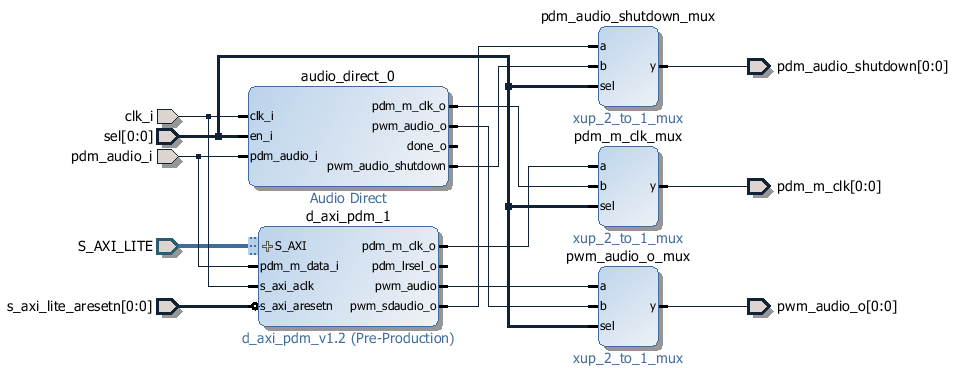

Pynq-Z1 audio Subsystem
============================

The Pynq-Z1 audio subsystem consists of an IP block to drive the PWM mono output, and another block to read the PDM input from the MIC.  
   

   
Examples
------------

See the example notebooks on the board in the directory:

.. code-block:: console

   base\audio

