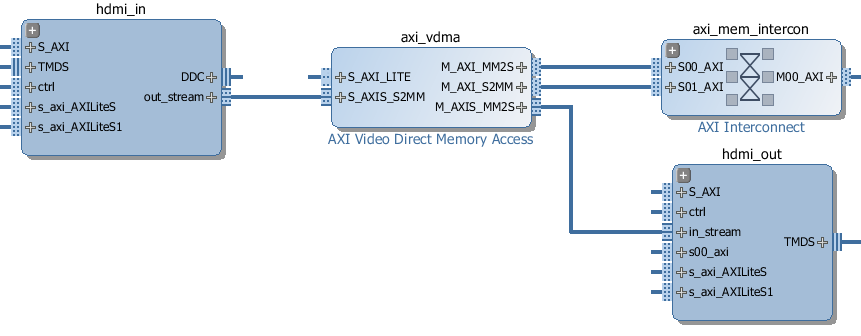
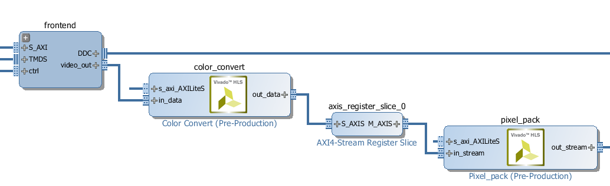
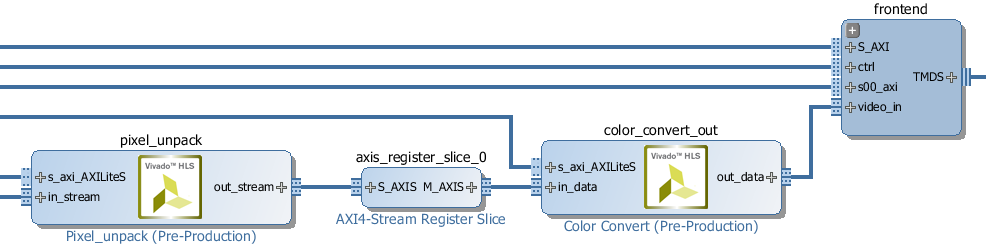

Video Subsystem
============================

The Video subsystem consists of a HDMI-in block, a HDMI-out block, and a Video DMA.  
   

   
Video data can be captured from the HDMI-in, and streamed to DRAM, or directly to the HDMI-out by the VDMA. Data can also be streamed from DRAM to the HDMI-out. 

The video subsystem also supports simple color space conversions from YCrCb to RGB and back. This is accomplished  by hardware blocks integrated into both the HDMI-in and HDMI-out blocks. 

HDMI-In
------------
   

The Pixel Unpack and the Color Convert block allow conversion between different color spaces at runtime. See below for more information on the color space. 

HDMI-Out
--------------
   

The HDMI-out is similar to HDMI-in. It has a Pixel Pack block (instead of the *Unpack* block for HDMI-in) and a Color Convert block. 

Color space conversion
---------------------------

The video subsystem supports conversion between different color spaces. The default color space is BGR. Supported color spaces include: RGB (24-bit), RGBA (32-bit), BGR (24-bit), YCbCr (24-bit), and grayscale (8-bit).

The colorspace converter operates on each pixel independently using a 3x4 matrix to transform the pixels. The converter is programmed with a list of twelve coefficients in the following order:

==== === === === ===
     in1 in2 in3  1 
==== === === === ===
out1 c1  c2  c3  c10
out2 c4  c5  c6  c11
out3 c7  c8  c9  c12
==== === === === ===

Each coefficient should be a floating point number between -2 and +2.

The pixels to and from the HDMI frontends are in BGR order so a list of coefficients to convert from the input format to RGB would be:

.. code-block:: Python

    [0, 0, 1,
     0, 1, 0,
     1, 0, 0,
     0, 0, 0]

 
reversing the order of the pixels and not adding any bias.
 
The resulting output order would be:

==== === === === ==
out1 c3  c2  c1  0 
out2 c6  c5  c4  0 
out3 c9  c8  c7  0 
==== === === === ==

The driver for the colorspace converters has a single property that contains the list of coefficients.

colorspace_in = base.video.hdmi_in.color_convert
colorspace_out = base.video.hdmi_out.color_convert

bgr2rgb = [0, 0, 1,
           0, 1, 0, 
           1, 0, 0,
           0, 0, 0]

colorspace_in.colorspace = bgr2rgb
colorspace_out.colorspace = bgr2rgb

colorspace_in.colorspace

Pixel Format
----------------
The default pixel format for the HDMI frontends is 24-bit. This can be converted to 8,24 or 32 bits. 

8-bit mode selects the first channel in the pixel (and drops the next 16-bits)
24-bit mode is pass-through, and doesn't change the format
32-bit mode pads the stream with additional 8-bits.

.. code-block:: Python

    pixel_in = base.video.hdmi_in.pixel_pack
    pixel_out = base.video.hdmi_out.pixel_unpack

    pixel_in.bits_per_pixel = 8
    pixel_out.bits_per_pixel = 8

    pixel_in.bits_per_pixel

Video processing
-----------------

There are 3 main ways that some processing could be carried out on a Video pipeline. 

1. Read, write and process frames in Python on the PS
2. Modify the overlay to insert an IP into the video pipeline
3. Modify the overlay to connect an IP to an available interface in the overlay

Processing in Python
^^^^^^^^^^^^^^^^^^^^^^^^

The HDMI input is streamed into a framebuffer in DRAM and is stored as a C array. The video subsystem can be set up to stream from the framebuffer directly to the HDMI out. However, this would not allow any processing in Python. 

The video subsystem can be set up to capture the input frame to a framebuffer, and for the HDMI out to read a frame from another framebuffer. This would allow reading of the input frame in Python, and some processing to be carried out, and the processed frame to be written to the HDMI out buffer. 

The frame objects are captured as Numpy arrays. This allows them to be directly used in other Python libraries including the Python OpenCV libraries. 

Processing video in the PS will be relatively slow. Where possible low level processing should be carried out in the PL. The video subsystem supports basic color space and pixel type conversions in hardware before passing a frame to the Python environment to improve performance of OpenCV and processing by other libraries. 

Video Pipeline processing
^^^^^^^^^^^^^^^^^^^^^^^^^^^

The HDMI signal blocks are AXI-stream. A custom AXI-stream IP with an input stream and output stream could be inserted into the video pipeline, either on the HDMI-In side, or HDMI-Out side. However, usually IP to process the video stream will assume a fixed color space/pixel format and this will determine where an IP should be connected in the Video pipeline. 

It is usually appropriate to insert he IP after the pixel_pack block on the HDMI-In block, or before the pixel_unpack block on the HDMI-Out side. This gives flexibility to use the video subsystem color space conversion blocks before and after the custom IP. 

Processing IP
^^^^^^^^^^^^^^^^^^^^^^^^^^^

An IP block can be added to an overlay and connected to an available interface. Usually a DMA would be used to stream the input frame buffer to the IP, and send the processed data back to the output frame buffer in DRAM. 

Note that the DRAM is likely to be a bottleneck for video processing. The Video data is written to DRAM, then read from DRAM and send to the custom IP and is written back to DRAM, where it is read by the HDMI out. 

For the PYNQ-Z1 which has a 16-bit DRAM, up to 1080p grayscale (8-bits per pixel) can be processed at ~60fps, but this is very close to the total memory bandwidth of the system. 

Examples
------------------

Basic HDMI operation
^^^^^^^^^^^^^^^^^^^^^^^^

Set up an instance of the HDMI-in, and HDMI-out. 

.. code-block:: Python

    from pynq.lib.video import HDMIIn, HDMIOut

    hdmi_in = HDMIIn('video')
    hdmi_out = HDMIOut('video')

The HDMI-in color space can be specified using the ``configure`` function. This step is optional, as HDMI will detect the color space from the input stream. The HDMI-in *mode* can be used to configure the HDMI-out block. This specifies the output color space. 

.. code-block:: Python

    hdmi_in.configure()
    hdmi_out.configure(hdmi_in.mode)
    
Supported color spaces are:

Once the HDMI controllers have been configured, they can be started:

.. code-block:: Python

    hdmi_in.start()
    hdmi_out.start()

To connect a simple stream from HDMI-in to HDMI-out, the two streams can be tied together.  

.. code-block:: Python

    hdmi_in.tie(hdmi_out)

This takes the unmodified input stream and passes it directly to the output, but doesn't allow processing of the frames. To do this, individual frames can also be read and written. 

.. code-block:: Python

    frame = hdmi_in.readframe()
    ...
    hdmi_out.writeframe(frame)
    
This would allow some processing could be carried out on the HDMI-in *frame* before writing it to the HDMI-out.

Notebook examples
--------------------

For more examples, see the Video notebooks on the board in the directory:

.. code-block:: console

   base\video